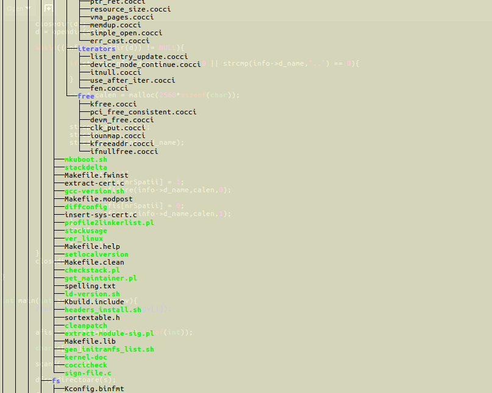

# SO

Here are some of the projects that helped me understand linux pipes, IPCs and files structure.

### Directory traversal



Dirtrav is a copy of the [tree]("https://linux.die.net/man/1/tree") call. It prints out the contents of the directory given as argument and (recursively) subdirectories as shown in the iamge above.


### Pipe Graph


Pipegraph is used as ``` ./pipegraph com1 arg11 ... arg1n ... comn argn1 ... argnn ``` where com1,...,comn are executable files, and arg11,...,argnn are the coresponding arguments.
  As shown in the scheme below, pipegraph has a main process that take input from the stdin, create n pipes and write the input to every pipe. Then it spawns n child processes which take the input from the corresponding  pipe and use the pipeo for output. The last process read from tubo and print the result to the stdout.
  
```

               /---> tubi1 ---> com1 ---\
             /                            \
     input    ........................    ---> tubo ---> output         
             \                            /
	       \---> tubin ---> comn ---/            

```


